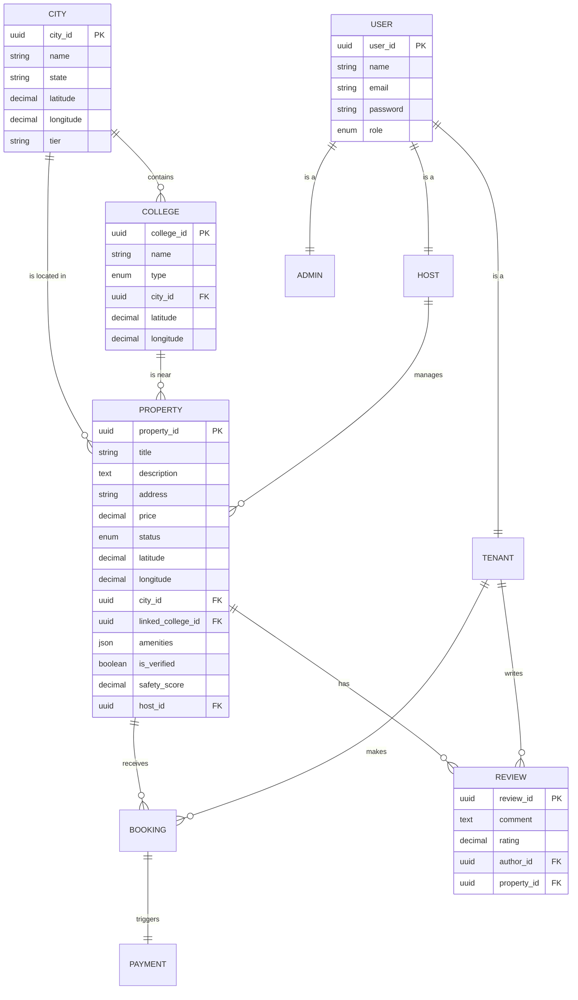

```mermaid
erDiagram
    CITY ||--o{ COLLEGE : contains
    CITY ||--o{ PROPERTY : "is located in"
    COLLEGE ||--o{ PROPERTY : "is near"
    
    USER ||--|| TENANT : "is a"
    USER ||--|| HOST : "is a"
    USER ||--|| ADMIN : "is a"
    
    HOST ||--o{ PROPERTY : manages
    PROPERTY ||--o{ BOOKING : receives
    TENANT ||--o{ BOOKING : makes
    
    BOOKING ||--|| PAYMENT : triggers
    PROPERTY ||--o{ REVIEW : has
    TENANT ||--o{ REVIEW : writes
    
    CITY {
        uuid city_id PK
        string name
        string state
        decimal latitude
        decimal longitude
        string tier
    }
    
    COLLEGE {
        uuid college_id PK
        string name
        enum type
        uuid city_id FK
        decimal latitude
        decimal longitude
    }
    
    PROPERTY {
        uuid property_id PK
        string title
        text description
        string address
        decimal price
        enum status
        decimal latitude
        decimal longitude
        uuid city_id FK
        uuid linked_college_id FK
        json amenities
        boolean is_verified
        decimal safety_score
        uuid host_id FK
    }
    
    USER {
        uuid user_id PK
        string name
        string email
        string password
        enum role
    }
    
    REVIEW {
        uuid review_id PK
        text comment
        decimal rating
        uuid author_id FK
        uuid property_id FK
    }
```