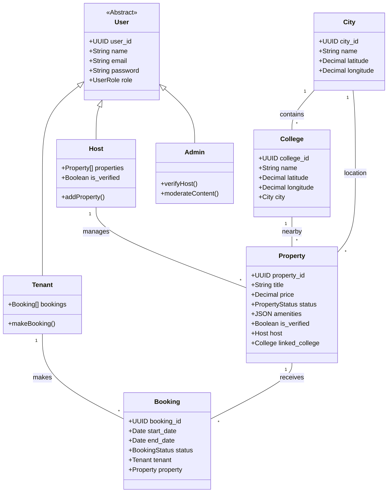

```mermaid
classDiagram
    class User {
        <<Abstract>>
        +UUID user_id
        +String name
        +String email
        +String password
        +UserRole role
    }
    
    class Tenant {
        +Booking[] bookings
        +makeBooking()
    }
    
    class Host {
        +Property[] properties
        +Boolean is_verified
        +addProperty()
    }

    class Admin {
        +verifyHost()
        +moderateContent()
    }
    
    class City {
        +UUID city_id
        +String name
        +Decimal latitude
        +Decimal longitude
    }
    
    class College {
        +UUID college_id
        +String name
        +Decimal latitude
        +Decimal longitude
        +City city
    }
    
    class Property {
        +UUID property_id
        +String title
        +Decimal price
        +PropertyStatus status
        +JSON amenities
        +Boolean is_verified
        +Host host
        +College linked_college
    }

    class Booking {
        +UUID booking_id
        +Date start_date
        +Date end_date
        +BookingStatus status
        +Tenant tenant
        +Property property
    }
    
    User <|-- Tenant
    User <|-- Host
    User <|-- Admin
    
    City "1" -- "*" College : contains
    City "1" -- "*" Property : location
    College "1" -- "*" Property : nearby
    Host "1" -- "*" Property : manages
    Tenant "1" -- "*" Booking : makes
    Property "1" -- "*" Booking : receives
```