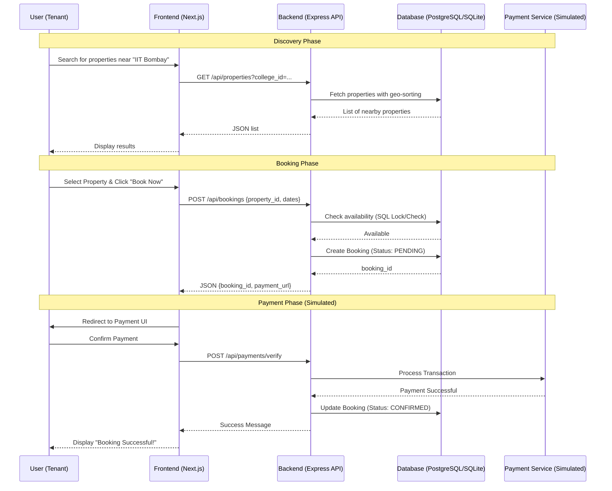

```mermaid
sequenceDiagram
    participant U as User (Tenant)
    participant F as Frontend (Next.js)
    participant B as Backend (Express API)
    participant DB as Database (PostgreSQL/SQLite)
    participant P as Payment Service (Simulated)

    Note over U, P: Discovery Phase
    U->>F: Search for properties near "IIT Bombay"
    F->>B: GET /api/properties?college_id=...
    B->>DB: Fetch properties with geo-sorting
    DB-->>B: List of nearby properties
    B-->>F: JSON list
    F-->>U: Display results

    Note over U, P: Booking Phase
    U->>F: Select Property & Click "Book Now"
    F->>B: POST /api/bookings {property_id, dates}
    B->>DB: Check availability (SQL Lock/Check)
    DB-->>B: Available
    B->>DB: Create Booking (Status: PENDING)
    DB-->>B: booking_id
    B-->>F: JSON {booking_id, payment_url}

    Note over U, P: Payment Phase (Simulated)
    F->>U: Redirect to Payment UI
    U->>F: Confirm Payment
    F->>B: POST /api/payments/verify
    B->>P: Process Transaction
    P-->>B: Payment Successful
    B->>DB: Update Booking (Status: CONFIRMED)
    B-->>F: Success Message
    F-->>U: Display "Booking Successful!"
```
