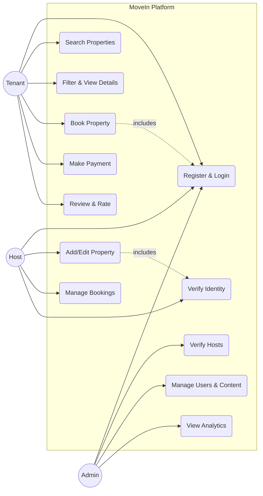

# MoveIn Use Case Diagram

```mermaid
flowchart LR
    %% Actors
    tenant((Tenant))
    host((Host))
    admin((Admin))

    %% System Boundary
    subgraph MoveIn_Platform [MoveIn Platform]
        login(Register & Login)
        search(Search Properties)
        view(Filter & View Details)
        book(Book Property)
        pay(Make Payment)
        review(Review & Rate)
        
        addProp(Add/Edit Property)
        manage(Manage Bookings)
        verifyID(Verify Identity)
        
        adminVerify(Verify Hosts)
        adminContent(Manage Users & Content)
        analytics(View Analytics)
    end

    %% Connections
    tenant --> login
    tenant --> search
    tenant --> view
    tenant --> book
    tenant --> pay
    tenant --> review

    host --> login
    host --> addProp
    host --> manage
    host --> verifyID

    admin --> login
    admin --> adminVerify
    admin --> adminContent
    admin --> analytics

    book -.->|includes| login
    addProp -.->|includes| verifyID
```
